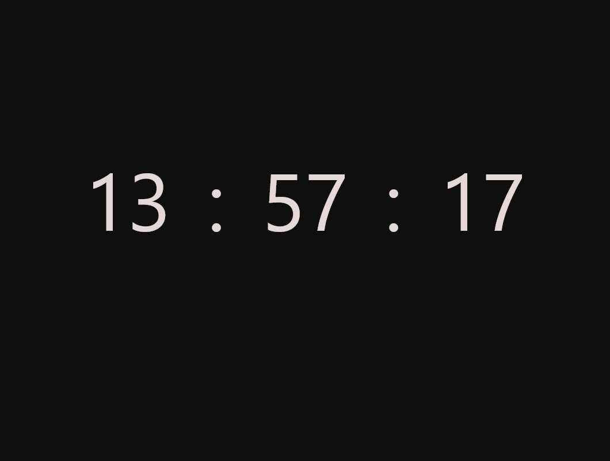
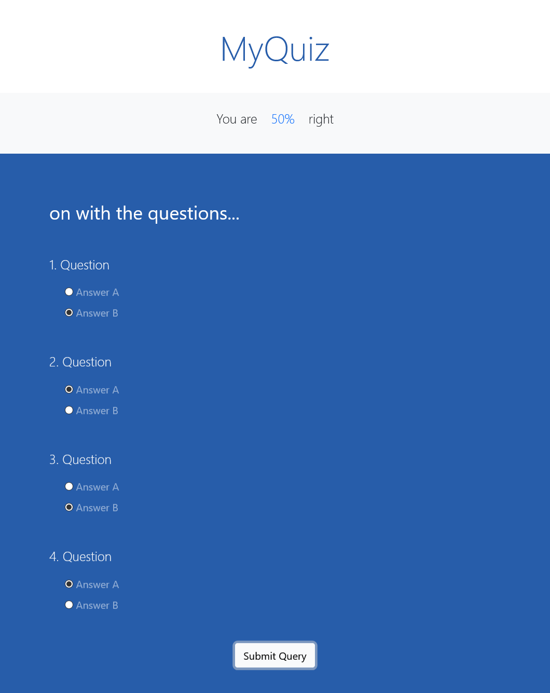
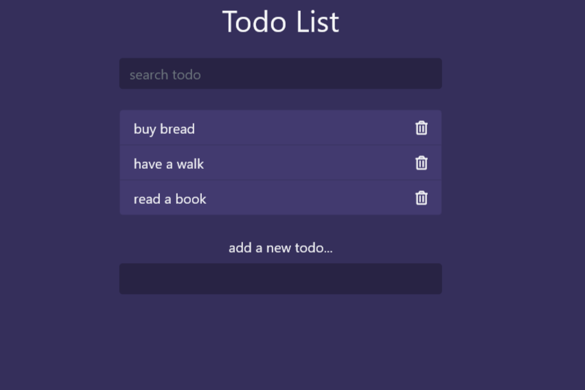

# Date Calculator

  

A simple date calculator written in HTML5, JavaScript ES6 which outputs how many years and days are passed from the entered date until now.  
The input field has a RegEx pattern which validates whether the entered date is in the format 'yyyy-mm-dd'. 
For the output is here used the "dateFns" library.

# Digital Clock

  

The app is created using the new Date object and its methods - getHours(), getMinutes(), getSeconds().

# MyQuiz

  

A simple quiz with 4 questions and 2 possible answers.  
The right answers are saved in an array and used to compare to the user's choice. 
The window methods are used in the application (scrollTo(), setInterval(), clearInterval()).

# ToDo List

  

A simple ToDo list with an option to add new todos, delete them. The user can also use the live search. 
The following features and tools are used in the app: 
* Sass
* bootstrap v.5.0.0. framework
* font-awesome toolkit.
